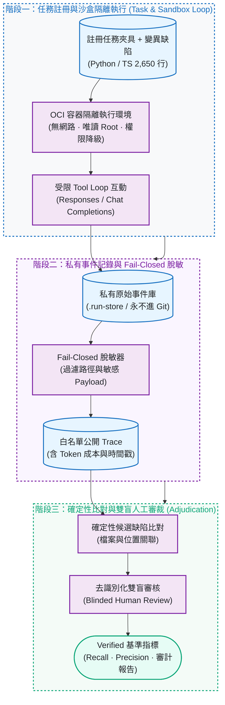
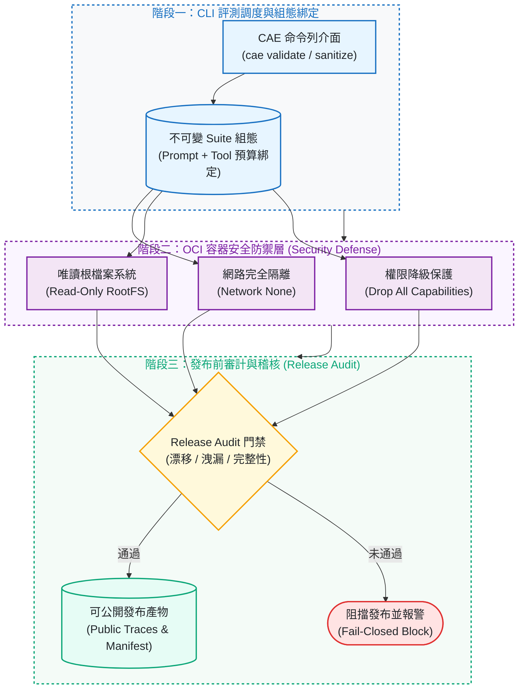

# coding-agent-eval

[](https://github.com/kuotunyu/coding-agent-eval/actions/workflows/ci.yml)


[](https://github.com/kuotunyu/coding-agent-eval/releases/latest)
[](LICENSE)

本專案建立一套針對 Coding Agent 程式缺陷發現能力之可重現評測基準工具鏈 (Reproducible Defect Discovery Benchmark Harness)：將缺陷挖掘轉化為具備嚴格審計追蹤之科學實驗——註冊不可變任務與 OCI 安全隔離容器、將私有原始 Payload 與白名單脫敏公開 Trace 嚴格隔離、並將 `verified_*` 量化指標保留給完全雙盲人工審核 (Blinded Human Adjudication)。

---

## 系統設計與關鍵特性

1. **不可變任務註冊與 OCI 沙盒隔離 (Task Registration & OCI Sandboxing)**：
   支援 Python (MIT) 與 TypeScript 雙原生測試夾具，包含 2,650 行受測代碼、396 項原生單元測試、8 組單一變異缺陷注入 (Seeded Mutations) 與 2 組乾淨對照組 (Clean Controls)；執行於無網路、唯讀 Root、權限降級之安全 OCI 容器。
2. **Fail-Closed 脫敏器與隱私保護 (Privacy & Sanitization)**：
   原始 Provider 通訊內容一律保留於未追蹤之 `.run-store/`，公開 Trace 僅允許白名單結構化欄位輸出，杜絕任何金鑰、本機路徑或敏感程式碼外洩。
3. **確定性候選匹配與雙盲人工審裁 (Deterministic Matching & Blinded Review)**：
   先以自動化規則完成檔案與行號範圍之候選匹配，再由去識別化雙盲工作表進行人工最終審定，避免將未經人工驗證之模型候選直接宣稱為正式指標。
4. **完整成本與失敗透明追蹤 (Cost & Failure Telemetry)**：
   所有 API 呼叫均綁定版本化定價表與 Token 預算監控，誠實保存所有終端失敗或超額輪次，不進行私下重試或挑選最佳結果。

---

## 系統架構與 Pipeline

### 1. 缺陷發現評測與脫敏審查流程



### 2. 執行環境與邊界防護架構



---

## 實驗證據與評測矩陣

本軟體 v0.1.1 版本建立於 BugSeed 基準 v0.1.0 之上，提供獨立脫敏協議與套件發布支援。本專案嚴格保持證據邊界，所有數值均有對應記錄佐證：

| 證據層級 (Evidence Layer) | 現有產物與記錄 | 所能支持之客觀推論 |
|---|---|---|
| Scripted Baseline | 確定性乾淨／變異夾具與合成審裁 | 驗證 Pipeline、匹配器、分母計算與重放回歸測試（非模型效能排名） |
| 2026-08-10 Reference Suite | 10/10 終端結果（10 tasks 均耗盡 Token 預算，0 檢出） | 舊版適配器／組態失敗歸因分析（非任務成功或排名依據） |
| Paid Smoke Attempt 1–2 | 對話連結修正；乾淨對照組耗盡預算 | 適配器 0.2 Trace 格式、隱私邊界與預算追蹤佐證 |
| Paid Smoke Attempt 3 | 適配器 0.3 / Prompt 0.2 完成；乾淨組 1 項檢出 (USD 0.031539) | 正常完成與 Trace 連結驗證；Smoke 門禁未通過 |
| Paid Smoke Attempt 4 | TaskQ 1.0.5 乾淨組完成；2 項機器重現候選 (USD 0.006662) | 當前計價、連結與隱私佐證；乾淨門禁未通過 |
| Paid Smoke Attempt 5 | TaskQ 1.0.6 乾淨組經 12 次工具呼叫耗盡預算 (USD 0.005426) | 適配器 0.3 連結、隱私與預算佐證；Smoke 門禁未通過 |
| Paid Smoke Attempt 6 | 適配器 0.4 乾淨組達 `step_exhausted` (USD 0.007277) | 適配器 0.4 多輪連結與隱私佐證；乾淨門禁未通過 |
| Human-verified Evidence | 尚無（保持空缺） | 不宣稱 `verified_bug_recall`、`verified_finding_precision` 或正式排行榜指標 |

---

## 快速開始

環境需求：Python 3.12 與 [uv](https://docs.astral.sh/uv/)。以下指令完全離線執行，無需 API Key 或付費 Provider：

### 1. 離線夾具驗證與發布審計

```bash
# 1. 複製專案並安裝鎖定依賴
git clone https://github.com/kuotunyu/coding-agent-eval.git
cd coding-agent-eval
uv sync --locked

# 2. 驗證測試夾具與發布產物合規性
uv run cae validate fixtures
uv run cae release audit --publication
```

執行輸出預期為乾淨無警告：

```text
fixture validation clean: fixtures
release artifact audit clean (0 warning(s))
```

### 2. 脫敏公開 Trace 產生

從現有未追蹤的原始運行紀錄中匯出安全公開 Trace：

```bash
uv run cae sanitize RUN_ID --store-root .run-store --out public-trace.jsonl
```

該指令僅接受單一現有 Run ID，拒絕將輸出寫入私有儲存區，且僅輸出脫敏器白名單之公開結構化投影，不產生未經審核之基準結論。

---

## 工程邊界與限制

1. **缺陷發現專屬評測**：本基準專注衡量缺陷發現 (Defect Discovery) 能力，非修復品質或通用代碼生成表現。
2. **第一方測試夾具邊界**：注入式夾具能精準控制 Ground Truth，但代碼規模有限，不能直接等同大型生產級代碼庫。
3. **安全沙盒定位**：容器門禁為實測防禦表現，非安全沙盒合規認證。
4. **候選與正式指標隔離**：完成之 Provider 回應不等於基準任務成功，未經雙盲人工審核之候選檢出不等於 Verified 檢出。

---

## 專案結構與文件導覽

- [Benchmark Card](docs/BENCHMARK_CARD.md)：評測指標定義、分母規範、實驗結果與局限性。
- [Data Card](docs/DATA_CARD.md)：語料來源、資料血統、開源授權與防污染邊界。
- [Reference Suite](docs/REFERENCE_SUITE.md)：基準註冊、執行、重放與證據鏈規範。
- [Release Readiness](docs/RELEASE_READINESS.md)：宣稱對照矩陣與發布門禁。

---

## 授權與引用

學術引用資訊已準備於 [CITATION.cff](CITATION.cff) 與 [.zenodo.json](.zenodo.json)。專案原始程式碼與測試夾具均採 [MIT License](LICENSE) 開源授權。
