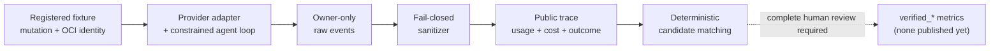

# coding-agent-eval

[](https://github.com/kuotunyu/coding-agent-eval/actions/workflows/ci.yml)
[](https://www.python.org/)
[](https://github.com/kuotunyu/coding-agent-eval/releases/latest)
[](LICENSE)

**A reproducible benchmark harness for measuring whether coding agents find seeded defects—while keeping unsupported findings, cost, failures, and evidence boundaries visible.**

本專案將 Coding Agent 的缺陷發現轉化為可審計實驗：註冊不可變任務與 digest-qualified OCI environments、透過受限 tool loop 執行 agent、分離 owner-only raw events 與 allowlisted public traces，並只在 primary 與 independent human reviewers 完整審查後發布 `verified_*` 指標。

---

## 系統設計與關鍵特性

1. **不可變任務註冊與受限 OCI execution (Task Registration & OCI Isolation)**：
   支援 Python (MIT) 與 TypeScript 雙原生測試夾具，包含 2,650 行受測代碼、396 項原生單元測試、8 組單一變異缺陷注入 (Seeded Mutations) 與 2 組乾淨對照組 (Clean Controls)；measure profile 觀察並驗證無網路、唯讀 Root、權限降級與資源限制等隔離條件。
2. **Fail-Closed 脫敏器與隱私保護 (Privacy & Sanitization)**：
   Provider request／response 與完整 tool material 留在未追蹤的 owner-only `.run-store/`；公開 Trace 只輸出已分類的 allowlisted fields，遇到未知欄位或已知敏感 pattern 即拒絕發布。這是可測試的資料邊界，不是對所有未知洩漏的絕對保證。
3. **確定性候選匹配與 blinded human adjudication**：
   自動化規則只依檔案、行號範圍與 category 建立 candidate pairs；primary 與 independent human reviewers 分別審查去識別化 worksheet，避免把定位相近的模型候選直接宣稱為 verified detection。
4. **完整成本與失敗透明追蹤 (Cost & Failure Telemetry)**：
   Registered provider runs 綁定版本化定價表與 token、tool、time、estimated-cost budgets；所有 terminal outcomes 都保留，不自動重試或挑選較好的結果。

---

## 我完成的核心工程 (What I built)

- 一套 versioned Python CLI，涵蓋 fixture validation、agent execution、sanitization、evaluation、suite registration、replay 與 publication audit。
- Responses API 與 Chat Completions adapters，保存 provider-native assistant turns、exact call-ID linkage、tool errors、completion 與 budget semantics。
- 兩個 first-party fixtures、八個 deterministic mutations、兩個 clean controls，以及 digest-qualified OCI environment identity。
- Append-only evidence model：raw events 留在 private store，public traces 經 field-level allowlist 與 leak scan 投影。
- Release contract：pytest、Ruff、strict mypy、wheel／sdist、Docker gates、fixture witnesses、OCI identity、Git provenance 與 archive privacy 都由 CI 或 release scripts 驗證。

最困難的工程問題是：在不公開 raw provider payload 的前提下正確延續多輪 function calling、把 prompt／adapter／fixture／runtime configuration 綁入 immutable suite identity，以及讓 budget exhaustion、provider error 與 failed smoke 成為正式證據而不是被重跑覆蓋。

---

## 系統架構與 Pipeline

### 1. 缺陷發現評測與脫敏審查流程



---

## 實驗證據與評測矩陣

本軟體 v0.1.1 版本建立於 BugSeed 基準 v0.1.0 之上，提供獨立脫敏協議與套件發布支援。本專案嚴格保持證據邊界，所有數值均有對應記錄佐證：

| 證據層級 (Evidence Layer) | 現有產物與記錄 | 所能支持之客觀推論 |
|---|---|---|
| Scripted Baseline | 確定性乾淨／變異夾具與合成審裁 | 驗證 Pipeline、匹配器、分母計算與重放回歸測試（非模型效能排名） |
| 2026-08-10 Reference Suite | 10/10 終端結果（10 tasks 均耗盡 Token 預算，0 檢出） | 舊版適配器／組態失敗歸因分析（非任務成功或排名依據） |
| Paid Smoke Attempt 1–2 | 對話連結修正；乾淨對照組耗盡預算 | 適配器 0.2 Trace 格式、隱私邊界與預算追蹤佐證 |
| Paid Smoke Attempt 3 | 適配器 0.3 / Prompt 0.2 完成；乾淨組 1 項檢出 (USD 0.031539) | 正常完成與 Trace 連結驗證；Smoke 門禁未通過 |
| Paid Smoke Attempt 4 | TaskQ 1.0.5 乾淨組完成；2 項機器重現候選 (USD 0.006662) | 該 run 的版本化計價、連結與隱私佐證；乾淨門禁未通過 |
| Paid Smoke Attempt 5 | TaskQ 1.0.6 乾淨組經 12 次工具呼叫耗盡預算 (USD 0.005426) | 適配器 0.3 連結、隱私與預算佐證；Smoke 門禁未通過 |
| Paid Smoke Attempt 6 | 適配器 0.4 乾淨組達 `step_exhausted` (USD 0.007277) | 適配器 0.4 多輪連結與隱私佐證；乾淨門禁未通過 |
| Paid Smoke Attempt 7 | 適配器 0.5 乾淨組正常完成、提交 1 項候選 (USD 0.010995) | 容量同步與無工具 finalization 的 live 佐證；零候選乾淨門禁未通過 |
| Human-verified Evidence | 尚無（保持空缺） | 不宣稱 `verified_bug_recall`、`verified_finding_precision` 或正式排行榜指標 |

七次 paid smoke 的 terminal outcomes 全部保留；其跨各自 versioned pricing tables 的 recorded estimates 合計 USD 0.102925。Attempt 7 證實 12 次 executable tool budget 後仍有無工具 final response 路徑，但 clean control 提交 1 項未驗證候選，故 gate 仍未通過；依預註冊序列沒有執行 conditional B-001、其他 mutation 或 rerun，也沒有新完整 suite、independent human ruling 或可發布的 `verified_*` headline metrics。

---

## 快速開始

環境需求：Python 3.12 與 [uv](https://docs.astral.sh/uv/)。以下指令完全離線執行，無需 API Key 或付費 Provider：

### 1. 離線夾具驗證與發布審計

```bash
# 1. 複製專案並安裝鎖定依賴
git clone https://github.com/kuotunyu/coding-agent-eval.git
cd coding-agent-eval
uv sync --locked

# 2. 驗證測試夾具與發布產物合規性
uv run cae validate fixtures
uv run cae release audit --publication
```

執行輸出預期為乾淨無警告：

```text
fixture validation clean: fixtures
release artifact audit clean (0 warning(s))
```

### 2. Provider-free 外部 agent 協定示範

下列 PowerShell 範例先將 fixture、Python 與範例 agent 解析為絕對路徑，然後以
`stdio-jsonl` 運行；不需要 API key，也不會呼叫付費 provider。

```powershell
$repoRoot = (Resolve-Path '.').Path
$python = (Resolve-Path '.venv/Scripts/python.exe').Path
$agent = (Resolve-Path 'examples/external_agents/scripted_agent.py').Path
$fixture = (Resolve-Path 'fixtures/fx-taskq-py').Path
$out = Join-Path $env:TEMP 'cae-stdio-demo'

uv run cae run $fixture --out $out --adapter stdio-jsonl `
  --agent-command $python --agent-arg $agent `
  --agent-name example-scripted-agent --agent-version 1.0.0 `
  --agent-model deterministic-script --max-tool-calls 4 `
  --max-wallclock-seconds 60
```

此範例只驗證 `cae-agent-stdio` 1.0.0 協定、tool loop 與證據路徑，不是 model
benchmark 結果，也不支持準確率或排名宣稱。外部程序由 operator 選擇並在 host 上以
`host_unsandboxed` 執行；其 usage 僅是 `agent_reported_unverified`，非 harness 獨立計量或強制的
token／cost 上限。完整操作與威脅邊界見 [Manual Run](docs/MANUAL_RUN.md) 與
[Threat Model](docs/THREAT_MODEL.md)。

### 3. 脫敏公開 Trace 產生

從現有未追蹤的原始運行紀錄中匯出安全公開 Trace：

```bash
uv run cae sanitize RUN_ID --store-root .run-store --out public-trace.jsonl
```

該指令僅接受單一現有 Run ID，拒絕將輸出寫入私有儲存區，且僅輸出脫敏器白名單之公開結構化投影，不產生未經審核之基準結論。

---

## 工程邊界與限制

1. **缺陷發現專屬評測**：本基準專注衡量缺陷發現 (Defect Discovery) 能力，非修復品質或通用代碼生成表現。
2. **第一方測試夾具邊界**：注入式夾具能精準控制 Ground Truth，但代碼規模有限，不能直接等同大型生產級代碼庫。
3. **隔離證據定位**：容器門禁是特定平台的 observed behavior，非 formal security proof、合規認證或長期 registry SLA。
4. **候選與正式指標隔離**：完成之 Provider 回應不等於基準任務成功；未經完整 blinded human review 的 candidate finding 不等於 verified detection。

---

## 專案結構與文件導覽

- [Benchmark Card](docs/BENCHMARK_CARD.md)：評測指標定義、分母規範、實驗結果與局限性。
- [Data Card](docs/DATA_CARD.md)：語料來源、資料血統、開源授權與防污染邊界。
- [Reference Suite](docs/REFERENCE_SUITE.md)：基準註冊、執行、重放與證據鏈規範。
- [Release Readiness](docs/RELEASE_READINESS.md)：宣稱對照矩陣與發布門禁。

---

## 授權與引用

引用 metadata 已準備於 [CITATION.cff](CITATION.cff) 與 [.zenodo.json](.zenodo.json)，但目前沒有 Zenodo record 或 DOI。專案原始程式碼與測試夾具均採 [MIT License](LICENSE) 開源授權。
