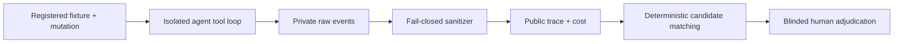

# coding-agent-eval

**A reproducible benchmark harness for measuring whether coding agents find seeded defects—and for keeping unsupported findings, cost, failures, and evidence boundaries visible.**

[](https://github.com/kuotunyu/coding-agent-eval/actions/workflows/ci.yml)
[](https://www.python.org/)
[](LICENSE)


`coding-agent-eval` turns agent defect discovery into an auditable experiment. It
registers immutable tasks and OCI environments, runs agents through a constrained tool
surface, separates private provider payloads from sanitized public traces, and reserves
`verified_*` metrics for complete blinded human review.



## 30-second offline quickstart

Requires Python 3.12 and [uv](https://docs.astral.sh/uv/). These commands do not read an
API key or call a paid provider.

```bash
git clone https://github.com/kuotunyu/coding-agent-eval.git
cd coding-agent-eval
uv sync --locked
uv run cae validate fixtures
uv run cae release audit --publication
```

Reproducible output from the current tree:

```text
fixture validation clean: fixtures
release artifact audit clean (0 warning(s))
```

## What I built

- A versioned Python CLI for fixture validation, agent execution, sanitization, replay,
  evaluation, suite registration, and publication auditing.
- Two first-party MIT fixtures—Python and TypeScript—with 2,639 in-scope LOC, 394 own
  tests, eight single-defect mutations, and two clean controls.
- Digest-qualified OCI environments and runtime checks for network isolation, read-only
  roots, dropped capabilities, resource limits, and host-path separation.
- Responses API and Chat Completions adapters with deterministic mocked coverage for
  multi-round tool calls, exact call-ID linkage, tool errors, completion, budgets, and
  replay.
- An append-only evidence model: owner-only raw events stay ignored; public traces expose
  allowlisted metadata; release audits detect drift, leakage, incomplete review, and
  non-owner Git provenance.

The hardest engineering problems were preserving provider-native conversation state
without publishing raw payloads, binding prompts and runtime configuration into suite
identity, and making failures first-class evidence instead of silently retrying or
selecting a better outcome.

## Evidence, without inflated claims

| Evidence layer | What exists | What it supports |
|---|---|---|
| Scripted baseline | Deterministic clean/mutated fixtures with synthetic adjudication | Pipeline, matcher, denominator, and replay regression tests—not model performance |
| 2026-08-10 reference suite | 10/10 retained terminal outcomes; all exhausted the token budget; zero findings | A legacy adapter/configuration failure analysis—not task success or a ranking |
| Paid smoke attempts 1–2 | Corrected conversation linkage; both clean runs exhausted their budgets | Adapter-0.2 trace, privacy, and budget evidence only |
| Paid smoke attempt 3 | Adapter 0.3/prompt 0.2 completed; one clean-control finding; USD 0.031539 | Normal completion and valid trace linkage; smoke gate still failed |
| Human-verified evidence | None yet | No `verified_bug_recall`, `verified_finding_precision`, or release headline metric |

Attempt 3's finding was mechanically reproduced and conservatively treated as a real
fixture defect; TaskQ 1.0.5 now binds completion to a monotonic lease generation. This is
an AI-assisted engineering correction, not an independent human ruling or a verified
benchmark detection. The mutated smoke task and full new suite were not run. All three
paid outcomes are retained; cumulative estimated cost was USD 0.072565.

## Engineering contract and limitations

- This benchmark measures defect discovery, not repair quality or general coding ability.
- Seeded first-party fixtures improve ground-truth control but are small and may not
  represent large production codebases.
- Container gates are observed-behaviour evidence, not a sandbox security certification.
- Provider prices and behavior can change; pricing versions and dates travel with runs.
- Public source necessarily reveals benchmark construction over time, so the project
  claims contamination resistance—not contamination freedom.
- A completed provider response is not a successful benchmark task, and a candidate
  finding is not a verified detection.

Detailed contracts:

- [Benchmark Card](docs/BENCHMARK_CARD.md): metrics, denominators, results, limitations
- [Data Card](docs/DATA_CARD.md): corpus, provenance, licensing, contamination boundaries
- [Reference Suite](docs/REFERENCE_SUITE.md): registration, execution, replay, evidence
- [Release Readiness](docs/RELEASE_READINESS.md): claim-to-evidence matrix and gates

## 正體中文導覽

這是一個 coding-agent 缺陷發現評估工具鏈，核心不是宣稱模型表現，而是讓 task
registration、OCI 執行環境、tool-calling trace、成本、失敗結果、sanitization 與 human
review 邊界可以重現與稽核。目前新版 smoke gate 尚未通過，也沒有可發布的
`verified_*` 指標；完整方法與限制請閱讀上方四份文件。

## Citation and license

Citation metadata is prepared in [CITATION.cff](CITATION.cff) and
[.zenodo.json](.zenodo.json), but no DOI or Zenodo publication is claimed. Source and
fixtures are released under the [MIT License](LICENSE).
